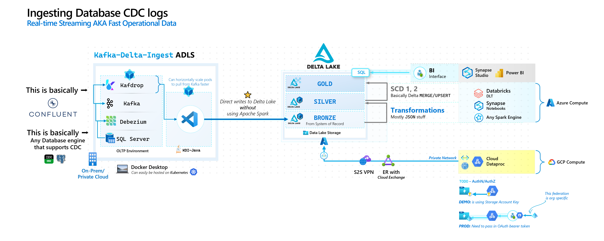

# kafka-delta-ingest-adls: Java

> An alternative to the official [`delta-io/kafka-delta-ingest`](https://github.com/delta-io/kafka-delta-ingest) which doesn't support Azure Storage yet

**Diagram**


**Demo**
[](https://youtu.be/kvCOlpE4KGs)

---
## Debezium Setup

### Quickstart
To get a working SQL Server + Debezium + Kafdrop setup:
```bash
cd /workspaces/kafka-delta-ingest-adls/0.Debezium-setup

export DEBEZIUM_VERSION=1.9
# Up
docker-compose -f 0.docker-compose-sqlserver.yaml -p "debezium-sandbox" up -d
# Down
docker-compose -f 0.docker-compose-sqlserver.yaml -p "debezium-sandbox" down

# Initiate SQL Server with CDC tables
cat 1.testDB-init.sql | docker-compose -f 0.docker-compose-sqlserver.yaml -p "debezium-sandbox" exec -T sqlserver bash -c '/opt/mssql-tools/bin/sqlcmd -U sa -P $SA_PASSWORD'

# Turn on Debezium for CDC ingestion
curl -i -X POST -H "Accept:application/json" -H  "Content-Type:application/json" http://connect-testDB:8083/connectors/ -d @2.testDB-register.json

# Go into SSMS and run demo transactions - 3.testDB-demo-inserts.sql
```
### Useful links from laptop
* SQL: `localhost,31433`
   * `sa:Password!`
* Kafdrop: `localhost:19000`
* Kafka:   `kafka:9092`

### `AdventureWorks` restore into existing SQL instance

```bash
cd /workspaces/kafka-delta-ingest-adls/0.Debezium-setup

# Download AdventureWorks backup
docker-compose -f 0.docker-compose-sqlserver.yaml -p "debezium-sandbox" exec -T sqlserver bash -c 'wget https://github.com/Microsoft/sql-server-samples/releases/download/adventureworks/AdventureWorks2019.bak -O /var/opt/mssql/data/AdventureWorks2019.bak 2>&1'

# Setup AdventureWorks and enable CDC
cat 4.adventureworks-init.sql | docker-compose -f 0.docker-compose-sqlserver.yaml -p "debezium-sandbox" exec -T sqlserver bash -c '/opt/mssql-tools/bin/sqlcmd -U sa -P $SA_PASSWORD'

# Turn on Debezium for CDC ingestion
curl -i -X POST -H "Accept:application/json" -H  "Content-Type:application/json" http://connect-AdventureWorks2019:8083/connectors/ -d @5.adventureworks-register.json
```

---
## Build and run KDI-Java as seperate Containers

Build Docker image:
```bash
cd /workspaces/kafka-delta-ingest-adls/1.KDI-Java

# Login to Dockerhub
docker login --username=mdrrakiburrahman --password=$DOCKERHUB_TOKEN
docker build -t mdrrakiburrahman/kdijava .
docker push mdrrakiburrahman/kdijava
```

Run KDI with env variables per table:
```bash
# - - - - - - - - -
# testDB
# - - - - - - - - -
# Up
docker-compose -f /workspaces/kafka-delta-ingest-adls/3.Kubernetes/docker-compose-kdi-testdb.yaml -p "kdi-clusters-testDB" --compatibility up -d
# Down
docker-compose -f /workspaces/kafka-delta-ingest-adls/3.Kubernetes/docker-compose-kdi-testdb.yaml -p "kdi-clusters-testDB" down

# - - - - - - - - -
# AdventureWorks
# - - - - - - - - -
# Up
docker-compose -f /workspaces/kafka-delta-ingest-adls/3.Kubernetes/docker-compose-kdi-adventureworks.yaml -p "kdi-clusters-adventureworks" --compatibility up -d
# Down
docker-compose -f /workspaces/kafka-delta-ingest-adls/3.Kubernetes/docker-compose-kdi-adventureworks.yaml -p "kdi-clusters-adventureworks" down
```
---

## Build and run KDI-Java locally as a single VSCode devcontainer

### Quickstart
Clean up Delta **folders**:
```bash
# Local
rm -rf /tmp/delta_standalone_write

# ADLS - perform via Storage Explorer
```

JAR: `install` and Launch:
```bash
cd /workspaces/kafka-delta-ingest-adls/1.KDI-Java
clear && mvn clean install && java -jar target/kdi-java-1.0-SNAPSHOT.jar
```

---
### Other details
Run locally:
```bash
cd /workspaces/kafka-delta-ingest-adls/src/main/java/com/microsoft/app
java App.java
```

Run via Maven with `java -cp`:
```bash
/workspaces/kafka-delta-ingest-adls
mvn clean package
java -cp target/kdi-java-1.0-SNAPSHOT.jar com.microsoft.kdi.KDI
```

Run as fat standalone jar:
```bash
/workspaces/kafka-delta-ingest-adls
mvn clean package
java -jar target/kdi-java-1.0-SNAPSHOT.jar
```

Run via maven:
```bash
mvn clean package
mvn exec:java -D exec.mainClass=com.microsoft.kdi.KDI
```

To pipe logs in case of errors:
```bash
java -jar target/kdi-java-1.0-SNAPSHOT.jar > err.txt 2>&1
```

## Kafka stuff

```bash
# List topics
/opt/kafka/bin/kafka-topics.sh \
--bootstrap-server kafka:9092 \
--list

# Delete a Consumer Group from a topic - useful for reseting stream
/opt/kafka/bin/kafka-consumer-groups.sh \
  --bootstrap-server kafka:9092 \
  --delete-offsets \
  --group kdi-java-1 \
  --topic server1.dbo.customers
```

## Spark stuff

```bash
/opt/spark/sbin/start-master.sh # http://localhost:8080/ Master UI
/opt/spark/sbin/start-worker.sh spark://$(hostname):7077 # http://localhost:8081/ Workers UI

# Go into Scala Shell with Delta - http://localhost:4040/ Jobs UI
/opt/spark/bin/spark-shell --packages io.delta:delta-core_2.12:1.0.0 \
  --conf "spark.sql.extensions=io.delta.sql.DeltaSparkSessionExtension" \
  --conf "spark.sql.catalog.spark_catalog=org.apache.spark.sql.delta.catalog.DeltaCatalog"

# [OPTIONAL] Go into PySpark Shell
# /opt/spark/bin/pyspark
```
### Write delta files

```scala
val table = "/tmp/delta_standalone_read/"
for (i <- 0 to 2) { // 3 Delta Versions - Scala loops are inclusive of bound
   spark.range(i * 10, (i + 1) * 10)
      .map(x => (x, x % 5, s"foo-${x % 2}"))
      .toDF("c1", "c2", "c3")
      .write
      .mode("append")
      .format("delta")
      .save(table)
}

spark.read.format("delta").load(table).count
// res1: Long = 30

spark.read.format("delta").load(table).limit(5).show
// +---+---+-----+
// | c1| c2|   c3|
// +---+---+-----+
// | 56|  1|foo-0|
// | 57|  2|foo-1|
// | 58|  3|foo-0|
// | 59|  4|foo-1|
// | 60|  0|foo-0|
// +---+---+-----+
```

And we see:
```bash
ls /tmp/delta_standalone_test
# _delta_log
# part-00000-195768ae-bad8-4c53-b0c2-e900e0f3eaee-c000.snappy.parquet
# part-00000-53c3c553-f74b-4384-b9b5-7aa45bc2291b-c000.snappy.parquet
# ..=

ls /tmp/delta_standalone_test/_delta_log/*.json
# /tmp/delta_standalone_test/_delta_log/00000000000000000000.json  /tmp/delta_standalone_test/_delta_log/00000000000000000002.json
# /tmp/delta_standalone_test/_delta_log/00000000000000000001.json
```

### Read delta files

```scala
val table = "/tmp/delta_standalone_write/"

spark.read.format("delta").load(table).count

spark.read.format("delta").load(table).show
```

## Debug locally

1. **Edit:**
   - Open `src/main/java/com/microsoft/app/App.java`.
   - Try adding some code and check out the language features.
   - Notice that the Java extension pack is already installed in the container since the `.devcontainer/devcontainer.json` lists `"vscjava.vscode-java-pack"` as an extension to install automatically when the container is created.
2. **Terminal:** Press <kbd>Ctrl</kbd>+<kbd>Shift</kbd>+<kbd>\`</kbd> and type `uname` and other Linux commands from the terminal window.
3. **Build, Run, and Debug:**
   - Open `src/main/java/com/microsoft/app/App.java`.
   - Add a breakpoint.
   - Press <kbd>F5</kbd> to launch the app in the container.
   - Once the breakpoint is hit, try hovering over variables, examining locals, and more.
4. **Run a Test:**
   - Open `src/test/java/com/microsoft/app/AppTest.java`.
   - Put a breakpoint in a test.
   - Click the `Debug Test` in the Code Lens above the function and watch it hit the breakpoint.

---

# Design notes

**References**
- [`kafka-delta-ingest` Ref](https://github.com/delta-io/kafka-delta-ingest/blob/main/doc/DESIGN.md)
- [Delta Transaction Protocol](https://github.com/delta-io/delta/blob/master/PROTOCOL.md#transaction-identifiers)

> Upon startup or partition assignment (in case of rebalance), to identify the last offset written to Delta Lake **for each assigned partition**, the kafka-delta-ingest process must locate the last `txn` action in the delta log for each of its assigned partitions and re-seek the consumer based on the `txn.version` attribute of the delta log.

Here's an example of a Spark Streaming Transaction Log vs `kdi-java`:

**Spark**
```json
{
   "txn":{
      "appId":"1a660dc3-9a1f-46a7-ad3f-b10e790bfc5f",
      "version":110,
      "lastUpdated":1648084804724
   }
}{
   "add":{
      "path":"part-00000-c62a6323-8049-4ba0-8b7c-1c161199b010-c000.snappy.parquet",
      "partitionValues":{
         
      },
      "size":121603,
      "modificationTime":1648084804000,
      "dataChange":true,
      "stats":"{\"numRecords\":1000,\"minValues\":{\"offset\":336002,\"timestamp\":\"2022-03-24T01:19:59.698Z\",\"bank\":\"BMO\",\"card_number\":\"372301002597450\",\"card_type\":\"americanexpress\",\"card_use_frequency\":\"Daily\",\"email_address\":\"aalldritt15@stumbleupon.com\",\"first_name\":\"Abran\",\"job_title\":\"Account Coordinator\",\"last_name\":\"Aartsen\",\"origin_state\":\"Alberta\",\"scene_id\":\"0063d519-f5e0-4fcb-9284-02ac539d\",\"trx_amount\":-7.37,\"trx_latitude\":42.103278,\"trx_longitude\":-135.1742264,\"trx_purchase_type\":\"Automotive\",\"trx_timestamp\":\"2016-01-01 17:11:20\"},\"maxValues\":{\"offset\":337001,\"timestamp\":\"2022-03-24T01:19:59.698Z\",\"bank\":\"Tangerine\",\"card_number\":\"5010129823786094\",\"card_type\":\"mastercard\",\"card_use_frequency\":\"Yearly\",\"email_address\":\"zstrotonejh@amazonaws.com\",\"first_name\":\"Zonda\",\"job_title\":\"Web Developer IV\",\"last_name\":\"ducarme\",\"origin_state\":\"Yukon Territory\",\"scene_id\":\"fff9f9f5-0ab5-43ce-9e75-3a583e13�\",\"trx_amount\":581.7,\"trx_latitude\":68.62602,\"trx_longitude\":-52.6912126,\"trx_purchase_type\":\"Toys\",\"trx_timestamp\":\"2024-03-30 18:45:04\"},\"nullCount\":{\"offset\":0,\"timestamp\":0,\"bank\":0,\"card_number\":0,\"card_type\":0,\"card_use_frequency\":0,\"email_address\":0,\"first_name\":0,\"job_title\":0,\"last_name\":0,\"origin_state\":0,\"scene_id\":0,\"trx_amount\":0,\"trx_latitude\":0,\"trx_longitude\":0,\"trx_purchase_type\":0,\"trx_timestamp\":0}}",
      "tags":{
         "INSERTION_TIME":"1648084804000000",
         "OPTIMIZE_TARGET_SIZE":"268435456"
      }
   }
}{
   "commitInfo":{
      "timestamp":1648084804725,
      "userId":"1145870272196957",
      "userName":"raki.rahman@microsoft.com",
      "operation":"STREAMING UPDATE",
      "operationParameters":{
         "outputMode":"Append",
         "queryId":"1a660dc3-9a1f-46a7-ad3f-b10e790bfc5f",
         "epochId":"110"
      },
      "notebook":{
         "notebookId":"1311460039577926"
      },
      "clusterId":"0211-140727-9171lf7m",
      "readVersion":109,
      "isolationLevel":"WriteSerializable",
      "isBlindAppend":true,
      "operationMetrics":{
         "numRemovedFiles":"0",
         "numOutputRows":"1000",
         "numOutputBytes":"121603",
         "numAddedFiles":"1"
      }
   }
}
```

**KDI-Java**
```json
{
   "commitInfo":{
      "timestamp":1650838707621,
      "operation":"WRITE",
      "operationParameters":{
         
      },
      "isolationLevel":"Serializable",
      "isBlindAppend":true,
      "operationMetrics":{
         
      },
      "engineInfo":"kdi-adls Delta-Standalone/0.4.0"
   }
}{
   "protocol":{
      "minReaderVersion":1,
      "minWriterVersion":2
   }
}{
   "metaData":{
      "id":"50558cb2-7975-44d8-86bd-87418960162d",
      "format":{
         "provider":"parquet",
         "options":{
            
         }
      },
      "schemaString":"{\"type\":\"struct\",\"fields\":[{\"name\":\"topic\",\"type\":\"string\",\"nullable\":true,\"metadata\":{}},{\"name\":\"key\",\"type\":\"string\",\"nullable\":true,\"metadata\":{}},{\"name\":\"value\",\"type\":\"string\",\"nullable\":true,\"metadata\":{}},{\"name\":\"offset\",\"type\":\"long\",\"nullable\":true,\"metadata\":{}},{\"name\":\"partition\",\"type\":\"integer\",\"nullable\":true,\"metadata\":{}},{\"name\":\"timestamp\",\"type\":\"long\",\"nullable\":true,\"metadata\":{}}]}",
      "partitionColumns":[
         
      ],
      "configuration":{
         
      },
      "createdTime":1650838707424
   }
}{
   "add":{
      "path":"part-00000-20be1494-7fe9-42b8-baa8-a08205b08379-c000.snappy.parquet",
      "partitionValues":{
         
      },
      "size":3609,
      "modificationTime":1650838706000,
      "dataChange":true
   }
}
```

> Delta files use new-line delimited JSON format, where every action is stored as a single line JSON document. A delta file, `n.json`, contains an atomic set of [actions](https://github.com/delta-io/delta/blob/master/PROTOCOL.md#Actions) that should be applied to the previous table state, `n-1.json`, in order to the construct nth snapshot of the table. An action changes one aspect of the table's state, for example, adding or removing a file.

* So basically, if schema changes, I guess that'll be an action as a new entry.

---

### `txn` **action**
- [Ref](https://github.com/delta-io/delta/blob/master/PROTOCOL.md#Schema-Serialization-Format)

```json
"txn":{
      "appId":"1a660dc3-9a1f-46a7-ad3f-b10e790bfc5f",
      "version":110,
      "lastUpdated":1648084804724
   }
```

Transaction identifiers are stored in the form of `appId` `version` pairs, where `appId` is a unique identifier for the process that is modifying the table and `version` is an indication of how much progress has been made by that application. The atomic recording of this information along with modifications to the table enables these external system to make their writes into a Delta table idempotent.

---
<details>
  <summary>Aspirational TO-DOs</summary>
  
   - [x]  Reads parquet from local
   - [x]  Writes parquet to local
   - [x]  Writes ***delta*** to local
      - [x]  Read from Spark to ensure Data is good (append only for CDC so F UPSERTs)
      - [x]  Read back
      - [x]  Disable Spark dependency for file generation

   **ADLS**

   - [x]  Read existing Delta table  from ADLS
   - [x]  Writes ***delta*** to **ADLS**
   - [x]  Reads back written delta from ADLS

   **Kafka + CDC**

   - [x]  Kafka simple consumer app
   - [x]  Kafka Message Schema POJO
   - [x]  Go through Debezium example to see Payload structure as JSON for CRUD
   - [x]  Read with the simple Consumer from EffectiveKafka for now

   **Integrate to Delta**

   - [x]  Tackle reading a single topic/CDC table - similar to KDI - take as `env` var (scalable)
   - [x]  Write to Delta local/ADLS/whatever in real-time timestamp buffer with 1 parquet
   - [x]  Make the Delta folder semantics `Broker -> Topic -> consumer=...`
   - [x]  Continuous app that keeps track of offsets properly in Kafka if we kill it - i.e. no Data Loss

   **Databricks Parse**

   - [x]  Quick single notebook to demunge a single table, and the original SQL table

   **Documentation**

   - [x]  Document/Diagram/Demo

   **Perf optimization/Best Practices**

   - [ ]  Make the buffer logic smart, instead of Sleep - make it poll Kafka to build up the buffer
      - [ ]  This means we can have Data loss as we `ack` messages - so we can’t use the Kafka `offset` anymore. We will need to look at `txn` thing deeper for KDI-rust
   - [ ]  Break of Java classes into KDI, Local, ADLS, etc.
   - [ ]  Make Unit Tests
   - [ ]  Make Date based partition for Delta Writes, rather than Consumer Group name
      - [ ]  Test with Concurrent Writers
   - [ ]  Test out Horizontal Scalability/Partition Rebalance etc

   **Containerize**

   - [ ]  Containerize/Dockerize/Docker-Compose with env
   - [ ]  Kubernetes manifests

   “**Enterprise ready**

   - [ ]  A Kubernetes Operator to inject Topic -> Delta Sink info - maybe wrap around a `ReplicaSet` for Horizontal Scalability?
   - [ ]  End-to-end demo with Confluent and Azure Arc SQL MI

   **Community?**

   - [ ]  Share with to Delta repo?
</details>
---